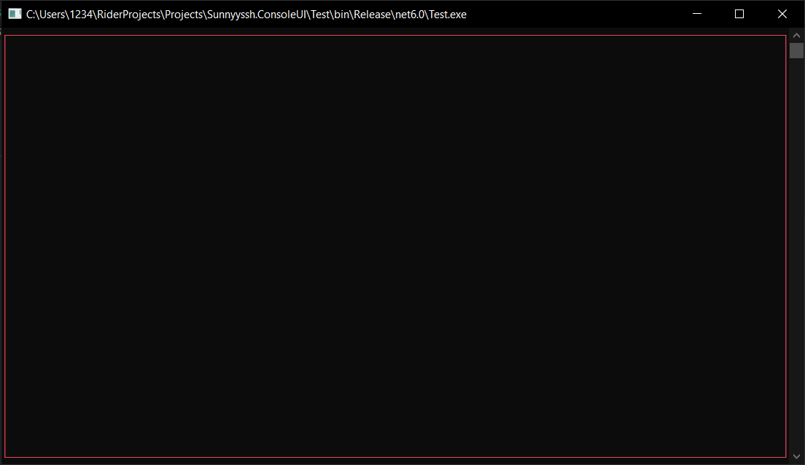

<h1>Border</h1>

```csharp
public abstract class Border : UIElement
```
You can find its source code in <a href="https://github.com/sunnyyssh/Sunnyyssh.ConsoleUI/blob/master/Sunnyyssh.ConsoleUI/UIElements/Borders/Border.cs">Border.cs</a>

<h3>Inheritors</h3>
1. `CharSetBorder` class in <a href="https://github.com/sunnyyssh/Sunnyyssh.ConsoleUI/blob/master/Sunnyyssh.ConsoleUI/UIElements/Borders/CharSetBorder.cs">CharSetBorder.cs</a>

<h2>Building</h2>
To build `Border` you should use `BorderBuilder`. (Its source code is in <a href="https://github.com/sunnyyssh/Sunnyyssh.ConsoleUI/blob/master/Sunnyyssh.ConsoleUI/UIElements/Borders/BorderBuilder.cs">BorderBuilder.cs</a>)

Here is an example:
```csharp
using Sunnyyssh.ConsoleUI;

var appBuilder = new ApplicationBuilder(new ApplicationSettings()); // App builder init.

// Border will cover the whole window because of Size.FullSize
// And it will have single line.
var borderBuilder = new BorderBuilder(Size.FullSize, BorderKind.SingleLine) // Creating builder.
{
    Color = Color.Red, // The color of border will be red.
};
    
appBuilder
    .Add(borderBuilder, Position.LeftTop) // Adds borderBuilder at (0, 0) position.
    .Build() // Application builds.
    .Run(); // Application runs.
```

It runs to this:
<br/>


