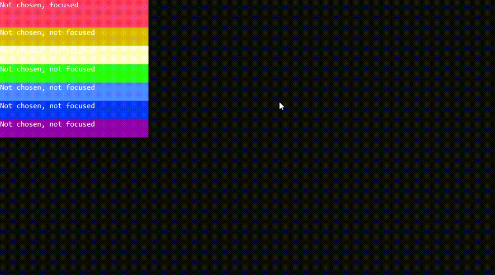
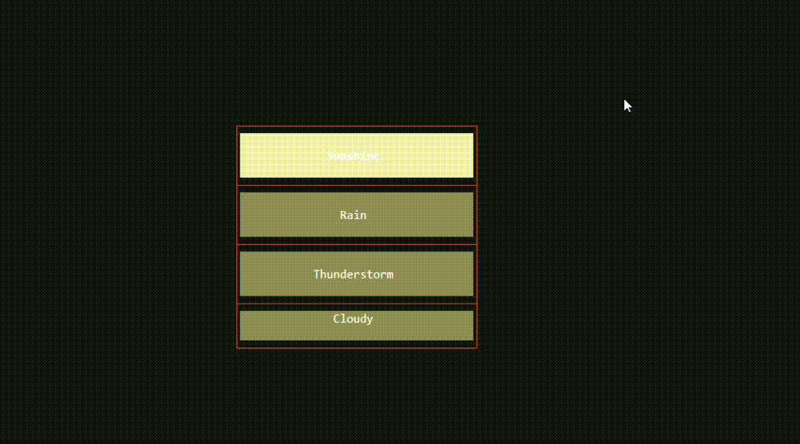

<h1>OptionChooser</h1>
It is base class for all choosers.

```csharp
public abstract class OptionChooser : UIElement, IFocusable
```
You can find its source code in <a href="https://github.com/sunnyyssh/Sunnyyssh.ConsoleUI/blob/master/Sunnyyssh.ConsoleUI/UIElements/OptionChooser/OptionChooser.cs">OptionChooser.cs</a>

<h3>Inheritors</h3>
1. WrapperBasedChooser class in <a href="https://github.com/sunnyyssh/Sunnyyssh.ConsoleUI/blob/master/Sunnyyssh.ConsoleUI/UIElements/OptionChooser/WrapperBasedChooser.cs">WrapperBasedChooser.cs</a>
2. RowChooser class in <a href="https://github.com/sunnyyssh/Sunnyyssh.ConsoleUI/blob/master/Sunnyyssh.ConsoleUI/UIElements/OptionChooser/RowChooser/RowChooser.cs">RowChooser.cs</a>
3. RowTextChooser class in <a href="https://github.com/sunnyyssh/Sunnyyssh.ConsoleUI/blob/master/Sunnyyssh.ConsoleUI/UIElements/OptionChooser/RowTextChooser/RowTextChooser.cs">RowTextChooser.cs</a>

<h1>WrapperBasedChooser</h1>
It is base class for all choosers that are based on wrappers. 

```csharp
public abstract class WrapperBasedChooser<TWrapper> : OptionChooser
    where TWrapper : Wrapper
```
You can find its source code in <a href="https://github.com/sunnyyssh/Sunnyyssh.ConsoleUI/blob/master/Sunnyyssh.ConsoleUI/UIElements/OptionChooser/WrapperBasedChooser.cs">WrapperBasedChooser.cs</a>

<h3>Inheritors</h3>
1. RowChooser class in <a href="https://github.com/sunnyyssh/Sunnyyssh.ConsoleUI/blob/master/Sunnyyssh.ConsoleUI/UIElements/OptionChooser/RowChooser/RowChooser.cs">RowChooser.cs</a>
2. RowTextChooser class in <a href="https://github.com/sunnyyssh/Sunnyyssh.ConsoleUI/blob/master/Sunnyyssh.ConsoleUI/UIElements/OptionChooser/RowTextChooser/RowTextChooser.cs">RowTextChooser.cs</a>


<h1>RowChooser</h1>
It is chooser which options are placed in a row. 

```csharp
public class RowChooser : WrapperBasedChooser<Grid>
```
You can find its source code in <a href="https://github.com/sunnyyssh/Sunnyyssh.ConsoleUI/blob/master/Sunnyyssh.ConsoleUI/UIElements/OptionChooser/RowChooser/RowChooser.cs">RowChooser.cs</a>

<h3>Inheritors</h3>
1. RowTextChooser class in <a href="https://github.com/sunnyyssh/Sunnyyssh.ConsoleUI/blob/master/Sunnyyssh.ConsoleUI/UIElements/OptionChooser/RowTextChooser/RowTextChooser.cs">RowTextChooser.cs</a>

<h2>Building</h2>
To build RowChooser you should use RowChooserBuilder. (Its source code is in <a href="https://github.com/sunnyyssh/Sunnyyssh.ConsoleUI/blob/master/Sunnyyssh.ConsoleUI/UIElements/OptionChooser/RowChooser/RowChooserBuilder.cs">RowChooserBuilder.cs</a>)

Here is an example:

```csharp
using Sunnyyssh.ConsoleUI;

var appBuilder = new ApplicationBuilder(new ApplicationSettings()); // App builder init.

// Chooser will be vertical, 30% width and 50% height.
var rowChooserBuilder = new RowChooserBuilder(0.3, 0.5, Orientation.Vertical)
{
    BorderKind = BorderKind.None, // Chooser will not have a border.
    CanChooseOnlyOne = false // Many options may be chosen.
    // KeySet = ..., // You can also specify a key set.
};

// My options.
var redOptionBuilder = new MyOptionBuilder(new Size(1.0, 1.0 / 7), Color.Red);
var darkYellowOptionBuilder = new MyOptionBuilder(new Size(1.0, 1.0 / 7), Color.DarkYellow);
var yellowOptionBuilder = new MyOptionBuilder(new Size(1.0, 1.0 / 7), Color.Yellow);
var greenOptionBuilder = new MyOptionBuilder(new Size(1.0, 1.0 / 7), Color.Green);
var blueOptionBuilder = new MyOptionBuilder(new Size(1.0, 1.0 / 7), Color.Blue);
var darkBlueOptionBuilder = new MyOptionBuilder(new Size(1.0, 1.0 / 7), Color.DarkBlue);
var darkMagentaOptionBuilder = new MyOptionBuilder(new Size(1.0, 1.0 / 7), Color.DarkMagenta);

// Add options to chooser.
rowChooserBuilder.Add(redOptionBuilder)
    .Add(darkYellowOptionBuilder)
    .Add(yellowOptionBuilder)
    .Add(greenOptionBuilder)
    .Add(blueOptionBuilder)
    .Add(darkBlueOptionBuilder)
    .Add(darkMagentaOptionBuilder);

appBuilder
    .Add(rowChooserBuilder, 0, 0) // Adds rowChooserBuilder at left and top position.
    .Build() // Application builds.
    .Run(); // Application runs.

sealed class MyOption : StateOptionElement
{
    public Color Color { get; }

    protected override DrawState RequestState(bool isChosen, bool isFocused)
    {
        var text = (isChosen, isFocused) switch
        {
            (false, false) => "Not chosen, not focused",
            (false, true) => "Not chosen, focused",
            (true, false) => "Chosen, not focused",
            (true, true) => "Chosen, Focused",
        };

        return new DrawStateBuilder(Width, Height)
            .Fill(Color)
            .Place(0, 0, text, Color, Color.Default)
            .ToDrawState();
    }

    internal MyOption(int width, int height, Color color) : base(width, height)
    {
        Color = color;
    }
}

sealed class MyOptionBuilder : IUIElementBuilder<MyOption>
{
    public Size Size { get; }
    
    public Color Color { get; }

    public MyOption Build(UIElementBuildArgs args) => new MyOption(args.Width, args.Height, Color);

    UIElement IUIElementBuilder.Build(UIElementBuildArgs args) => Build(args);

    public MyOptionBuilder(Size size, Color color)
    {
        Size = size;
        Color = color;
    }
}
```

It runs to this:
<br/>



<h1>RowChooser</h1>
It is chooser of text options that are placed in a row. 

```csharp
public sealed class RowTextChooser : RowChooser
```
You can find its source code in <a href="https://github.com/sunnyyssh/Sunnyyssh.ConsoleUI/blob/master/Sunnyyssh.ConsoleUI/UIElements/OptionChooser/RowTextChooser/RowTextChooser.cs">RowTextChooser.cs</a>

<h2>Building</h2>
To build RowTextChooser you should use RowTextChooserBuilder. (Its source code is in <a href="https://github.com/sunnyyssh/Sunnyyssh.ConsoleUI/blob/master/Sunnyyssh.ConsoleUI/UIElements/OptionChooser/RowTextChooser/RowTextChooserBuilder.cs">RowTextChooserBuilder.cs</a>)

Here is an example:

```csharp
using Sunnyyssh.ConsoleUI;

var appBuilder = new ApplicationBuilder(new ApplicationSettings()); // App builder init.

// Chooser will be vertical, 30% width and 50% height.
var rowTextChooserBuilder = new RowTextChooserBuilder(0.3, 0.5, Orientation.Vertical)
{
    CanChooseOnlyOne = false, // Many options may be chosen.
    BorderKind = BorderKind.SingleLine,
    BorderColor = Color.Red,
    ColorSet = new TextOptionColorSet(Color.DarkGray, Color.White) // Specifies colors of text options.
    {
        ChosenBackground = Color.DarkBlue,
        ChosenFocusedBackground = Color.Blue,
        FocusedBackground = Color.Gray,
    }
};

// Add text options.
rowTextChooserBuilder.Add("Sunshine")
    .Add("Rain")
    .Add("Thunderstorm")
    .Add("Cloudy");

appBuilder
    .Add(rowTextChooserBuilder, 0.3, 0.3) // Adds rowTextChooserBuilder at 30% left and 30% top position.
    .Build() // Application builds.
    .Run(); // Application runs.

```

It runs to this:
<br/>


