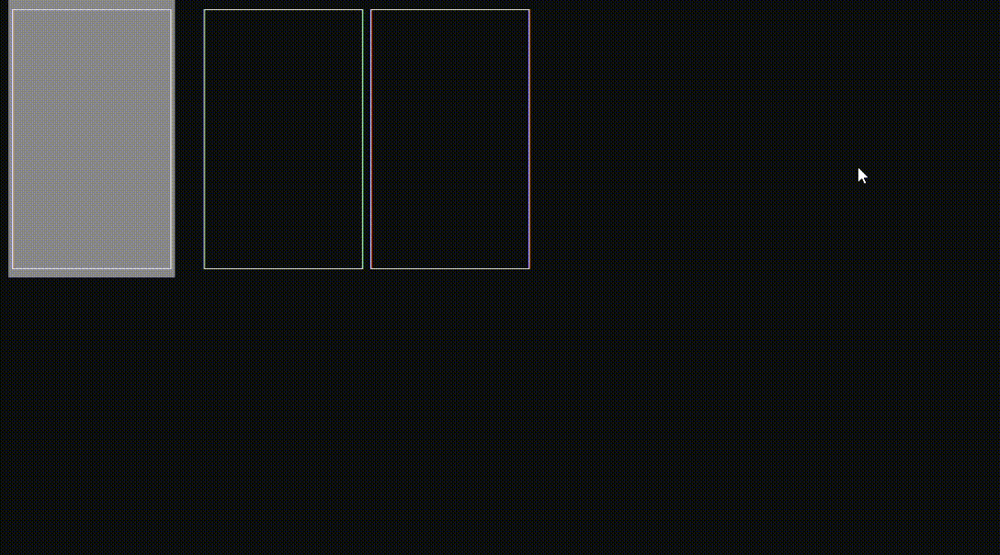

<h1>StackPanel</h1>

It's Wrapper that contains its children in a row (like a stack).

```csharp
public class StackPanel : CompositionWrapper
```
You can find its source code in <a href="https://github.com/sunnyyssh/Sunnyyssh.ConsoleUI/blob/master/Sunnyyssh.ConsoleUI/UIElements/Wrappers/StackPanel/StackPanel.cs">StackPanel.cs</a>

<h2>Building</h2>
To build StackPanel you should use StackPanelBuilder. (Its source code is in <a href="https://github.com/sunnyyssh/Sunnyyssh.ConsoleUI/blob/master/Sunnyyssh.ConsoleUI/UIElements/Wrappers/StackPanel/StackPanelBuilder.cs">StackPanelBuilder.cs</a>)
<br/>

```csharp
public sealed class StackPanelBuilder : IUIElementBuilder<StackPanel>
```


Here is an example:

```csharp
using Sunnyyssh.ConsoleUI;

var appBuilder = new ApplicationBuilder(
    new ApplicationSettings() { DefaultForeground = Color.Gray }); // app builder init.

// StackPanel will be horizontal, 100% width and 50% height.
var stackPanelBuilder = new StackPanelBuilder(1.0, 0.5, Orientation.Horizontal)
{
    FocusFlowLoop = true, // Focus flow should be looped.
    OverridesFocusFlow = true, // All keys will be handled by this StackPanel. 
};

// TextBox will be 20 pixels width and 100% height.
var textBoxBuilder = new TextBoxBuilder(20, 1.0)
{
    FocusedBackground = Color.DarkGray,
    BorderKind = BorderKind.SingleLine,
    WordWrap = true,
    UserEditable = true,
};

stackPanelBuilder.Add(textBoxBuilder, 1) // Add textBoxBuilder with 1 pixel offset.
    .Add(textBoxBuilder, 3)
    .Add(textBoxBuilder); // Add textBoxBuilder without offset.

appBuilder
    .Add(stackPanelBuilder, Position.LeftTop) // Add stackPanelBuilder at left top position.
    .Build() // Application builds.
    .Run(); // Application runs.
```

It runs to this:
<br/>


