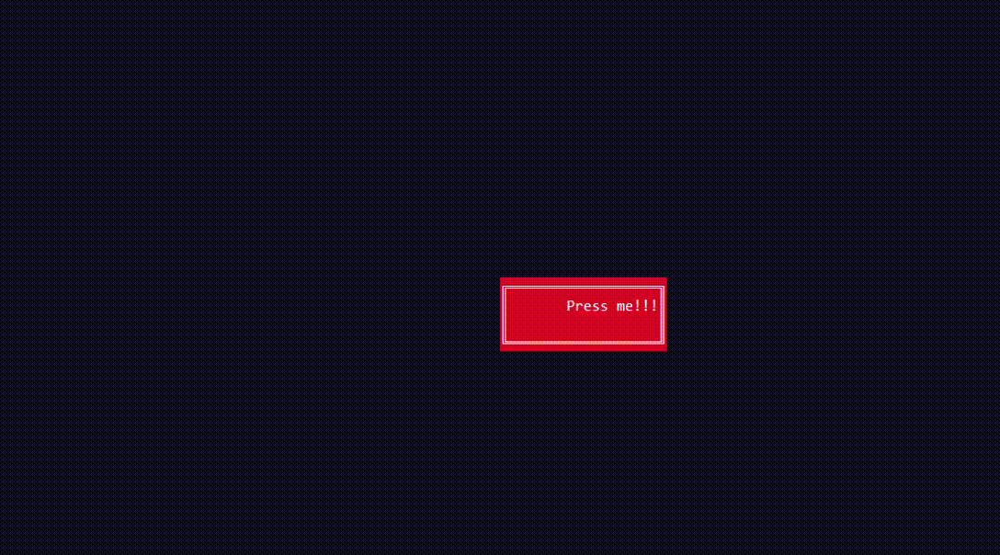

<h1>Button</h1>

```csharp
public sealed class Button : UIElement, IFocusable
```
You can find its source code in <a href="../src/UIElements/Button/Button.cs">Button.cs</a>

<h2>Building</h2>
To build `Button` you should use `ButtonBuilder`. (Its source code is in <a href="../src/UIElements/Button/ButtonBuilder.cs">ButtonBuilder.cs</a>)
<br/>
```csharp
public sealed class ButtonBuilder : IUIElementBuilder<Button>
```


Here is an example:
```csharp
using System.Collections.Immutable;
using Sunnyyssh.ConsoleUI;

var appBuilder = new ApplicationBuilder(new ApplicationSettings()); // App builder init.

// Button will be 20*20 pixels.
var buttonBuilder = new ButtonBuilder(20, 4) // Creating builder.
{
    NotFocusedBackground = Color.DarkRed, // The background will be red.
    NotFocusedForeground = Color.White, // The foreground will be white.
    ShowPress = true, // If it's pressed it will show it by changing its color. (Specified below).
    PressedBackground = Color.Blue, // Specifies background when it is pressed.
    PressedBorderColor = Color.DarkYellow, // Specifies foreground when it is pressed.
    Text = "Press me!!!", // Text of the button.
    LoseFocusAfterPress = true, // Specifies that button should lose focus when it's pressed.
    HandledKeys = ImmutableList.Create(ConsoleKey.Enter), // Keys detected as pressed.
    BorderKind = BorderKind.DoubleLine, // Border will be double-lined.
    TextHorizontalAligning = HorizontalAligning.Right, // Text aligns to the right.
    TextVerticalAligning = VerticalAligning.Top // Text aligns to the top.
};
    
appBuilder
    .Add(buttonBuilder, 0.5, 0.5) // Adds buttonBuilder at the relational center position.
    .Build() // Application builds.
    .Run(); // Application runs.
```

It runs to this:
<br/>


