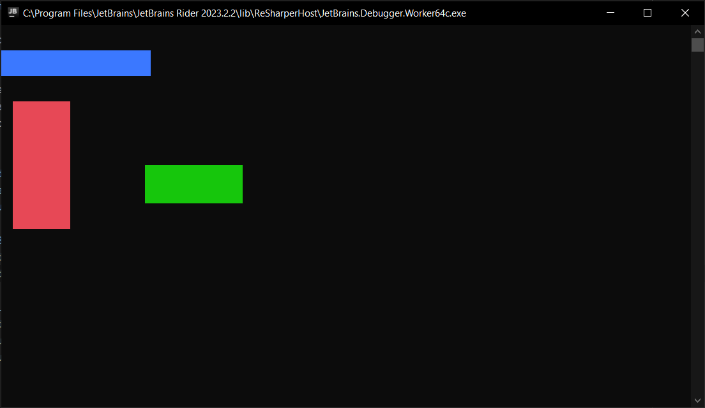

<h1>Canvas</h1>

```csharp
public sealed class Canvas : CompositionWrapper
```
You can find its source code in <a href="https://github.com/sunnyyssh/Sunnyyssh.ConsoleUI/blob/master/Sunnyyssh.ConsoleUI/UIElements/Wrappers/Canvas/Canvas.cs">Canvas.cs</a>

<h2>Building</h2>
To build Canvas you should use CanvasBuilder . (Its source code is in <a href="https://github.com/sunnyyssh/Sunnyyssh.ConsoleUI/blob/master/Sunnyyssh.ConsoleUI/UIElements/Wrappers/Canvas/CanvasBuilder.cs">CanvasBuilder.cs</a>)
<br/>

```csharp
public sealed class CanvasBuilder : IUIElementBuilder<Canvas>
```

Here is an example:
```csharp
using System.Collections.Immutable;
using Sunnyyssh.ConsoleUI;

var appBuilder = new ApplicationBuilder(new ApplicationSettings()); // App builder init.

// Canvas will be 70% of its owner width and 80% of its owner height.
var canvasBuilder = new CanvasBuilder(0.7, 0.8) // Creating builder.
{
    FocusFlowLoop = false, // If focus flow ends Canvas should lose focus.
    // Pressed keys will be handled by Canvas's owner before they will be handled by Canvas.
    // if it is true then Canvas should handle All pressed keys.
    OverridesFocusFlow = false, 
    EnableOverlapping = true, // Children may overlap each other. 
    FocusChangeKeys = ImmutableList.Create(ConsoleKey.Tab) // It will switch between IFocusable elements by pressing Tab.
};

var redRectBuilder = new RectangleBuilder(10, 10, Color.Red); // Red rectangle builder.
var greenRectBuilder = new RectangleBuilder(0.2, 0.1, Color.Green); // Green rectangle builder.
var blueRectBuilder = new RectangleBuilder(0.3, 2, Color.Blue); // Blue rectangle builder.

canvasBuilder.Add(redRectBuilder, 2, 4) // Add rectangle builders.
    .Add(greenRectBuilder, 0.3, 0.4)
    .Add(blueRectBuilder, Position.LeftTop);

appBuilder
    .Add(canvasBuilder, 0, 2) // Adds canvasBuilder at 0 from left and 2 pixels from top.
    .Build() // Application builds.
    .Run(); // Application runs.
```

It runs to this:
<br/>


