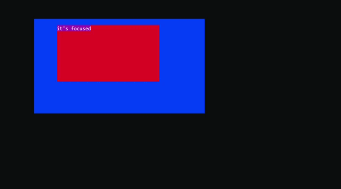

<h1>How to implement your own UIElement</h1>

- First off, look what UIElement actually is and what it gives to the inheritors. [UIElement](UIElement.doc.md)
- If you're going to implement element that contains other elements try implementing [Wrapper](Wrapper.doc.md)
- If you're going to implement element that should handle pressed keys it should implement [IFocusable](IFocusable.doc.md)
- You will get better understanding how to do it if you will watch simple implementations in the source code: for example, [Rectangle](Rectangle.doc.md) or [Canvas](Canvas.doc.md)
- You can watch what role UIElement has in [Core](Core.doc.md).
- I recommend you to look at [UIElement.cs](../src/Core/UIElement/UIElement.cs) source code and its protected or public members that give you some opportunities.
- With T : UIElement implementation you should also implement IUIElementBuilder<T> to use it. 

I think if you understand everything above you will manage.

Here is my simple demo implemetation with some explanations (Actually, it does weird things but it's just an example):

```csharp
using Sunnyyssh.ConsoleUI;

namespace Test;

// I recommend you to implement IFocusable's members implicitly to hide them.
// Otherwise, it may cause some safety problems.
public sealed class MyUIElement : UIElement, IFocusable 
{
    public Color Color { get; }
    private ForceTakeFocusHandler? _forceTakeFocusHandler;
    
    private ForceLoseFocusHandler? _forceLoseFocusHandler;

    protected override DrawState CreateDrawState()
    {
        // DrawStateBuilder will help us to create DrawState.
        var drawStateBuilder = new DrawStateBuilder(Width, Height); // UIElement's width and height gotten.

        drawStateBuilder.Fill(Color);
        if (IsFocused)
        {
            drawStateBuilder.Place(0, 0, "it's focused", Color.DarkMagenta, Color.White);
        }

        // return created state.
        return drawStateBuilder.ToDrawState();
    }

    public bool IsWaitingFocus { get; } = true; // It will always wait for focus.

    public bool IsFocused { get; private set; }

    void IFocusable.TakeFocus()
    {
        // IsFocused must be set to true.
        IsFocused = true;
        if (IsStateInitialized)
        {
            // If DrawState of this element is initialized it should renew it because focused state differs.
            Redraw(CreateDrawState());
        }

        Task.Delay(2000)
            .ContinueWith(_ =>
            {
                if (IsFocused)
                {
                    // If after 2 seconds it's still focused then it must lose it.
                    // It makes no sense but it's just for example.
                    _forceLoseFocusHandler?.Invoke(this);
                }
            });
    }

    void IFocusable.LoseFocus()
    {
        // IsFocused must be set to false.
        IsFocused = false;
        if (IsStateInitialized)
        {
            // If DrawState of this element is initialized it should renew it because focused state differs.
            Redraw(CreateDrawState());
        }
        
        Task.Delay(3000)
            .ContinueWith(_ =>
            {
                if (IsFocused)
                {
                    // If after 3 seconds it's still not focused then it must take it.
                    // It makes no sense but it's just for example.
                    _forceTakeFocusHandler?.Invoke(this);
                }
            });
    }

    bool IFocusable.HandlePressedKey(ConsoleKeyInfo keyInfo)
    {
        // It will lose focus every time the key is pressed.
        return false;
    }

    event ForceTakeFocusHandler? IFocusable.ForceTakeFocus
    {
        add => _forceTakeFocusHandler += value;
        remove => _forceTakeFocusHandler -= value;
    }

    event ForceLoseFocusHandler? IFocusable.ForceLoseFocus
    {
        add => _forceLoseFocusHandler += value;
        remove => _forceLoseFocusHandler -= value;
    }

    internal MyUIElement(int width, int height, OverlappingPriority priority, Color color) : base(width, height, priority)
    {
        Color = color;
    }
}

// It will build element.
public sealed class MyUIElementBuilder : IUIElementBuilder<MyUIElement>
{
    public Size Size { get; }

    public OverlappingPriority OverlappingPriority { get; init; } = OverlappingPriority.Medium;
    public Color Color { get; init; }

    public MyUIElement Build(UIElementBuildArgs args)
    {
        // Here could be resolving some properties.
        return new MyUIElement(args.Width, args.Height, OverlappingPriority, Color);
    }

    UIElement IUIElementBuilder.Build(UIElementBuildArgs args) => Build(args);

    public MyUIElementBuilder(Size size)
    {
        Size = size;
    }
}
```


It can be used in this way:

```csharp
using Sunnyyssh.ConsoleUI;
using Test;

var appBuilder = new ApplicationBuilder(
    new ApplicationSettings() { DefaultForeground = Color.Gray }); // app builder init.

var elementBuilder1 = new MyUIElementBuilder(new Size(0.5, 0.5))
{
    Color = Color.DarkBlue,
    OverlappingPriority = OverlappingPriority.Low
};
var elementBuilder2 = new MyUIElementBuilder(new Size(0.3, 0.3))
{
    Color = Color.DarkRed,
    OverlappingPriority = OverlappingPriority.High,
};

appBuilder.Add(elementBuilder1, 12, 3)
    .Add(elementBuilder2, 20, 4);

appBuilder.Build().Run();
```

This code runs like this:
<br/>
