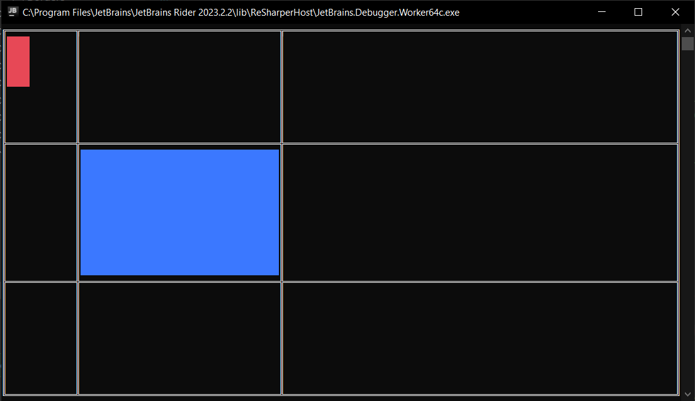

<h1>Grid</h1>

```csharp
public sealed class Grid : CompositionWrapper
```
You can find its source code in <a href="../src/UIElements/Wrappers/Grid/Grid.cs">Grid.cs</a>

<h2>Building</h2>
To build Grid you should use GridBuilder. (Its source code is in <a href="../src/UIElements/Wrappers/Grid/GridBuilder.cs">GridBuilder.cs</a>)
<br/>

```csharp
public sealed class GridBuilder : IUIElementBuilder<Grid>
```

Here is an example:

```csharp
using System.Collections.Immutable;
using Sunnyyssh.ConsoleUI;

var appBuilder = new ApplicationBuilder(new ApplicationSettings()); // App builder init.

var gridColumns = GridColumnDefinition.From(
    new[]
    {
        GridColumn.FromWidth(12), // Column will have 12 pixels width.
        GridColumn.FromColumnRelation(1.0), // Column will fill 1/3 of the whole width that is free from columns with specified size.
        GridColumn.FromColumnRelation(2.0), // Column will fill 2/3 of the whole width that is free from columns with specified size.
    });
var gridRows = GridRowDefinition.From(
    new[]
    {
        GridRow.FromHeight(0.3), // Row will have 30% height of the whole height.
        GridRow.FromHeight(10), // Row will have 10 pixels height.
        GridRow.FromRowRelation(1.0), // Row will fill the whole height that is free from rows with specified height.
    });

var gridDefinition = new GridDefinition(gridRows, gridColumns);

// Grid will be full-sized.
var gridBuilder = new GridBuilder(Size.FullSize, gridDefinition)
{
    FocusChangeKeys = ImmutableList<ConsoleKey>.Empty, // No keys will change focus linearly.
    FocusUpKeys = ImmutableList.Create(ConsoleKey.UpArrow), // Up key will change focus to upper IFocusable element.
    FocusDownKeys = ImmutableList.Create(ConsoleKey.DownArrow), // Down key will change focus to lower IFocusable element.
    FocusFlowLoop = true, // The focus flow is looped.
    OverridesFocusFlow = true, // It handles All pressed keys. The owner will not handle any (except SpecialKey, watch FocusFlowManager.cs).
    BorderColor = Color.Default, // Border color will be default foreground color of an application.
    BorderKind = BorderKind.DoubleLine, // Border is double-lined.
};

// Blue rectangle will fill the whole cell of the grid (not the whole grid, only its cell).
var blueRectangleBuilder = new RectangleBuilder(Size.FullSize, Color.Blue);
// Red rectangle will fill 30% of width and 40% of height of its cell.
var redRectangleBuilder = new RectangleBuilder(0.3, 0.4, Color.Red);

gridBuilder.Add(blueRectangleBuilder, row: 1, column: 1, out var builtRect)
    .Add(redRectangleBuilder, row: 0, column: 0);

appBuilder
    .Add(gridBuilder, Position.LeftTop) // Adds gridBuilder at left and top position.
    .Build() // Application builds.
    .Run(); // Application runs.
    
builtRect.WaitInitialization();
// You can get built rectangle using this.
Rectangle rect = builtRect.Element;
```

It runs to this:
<br/>


