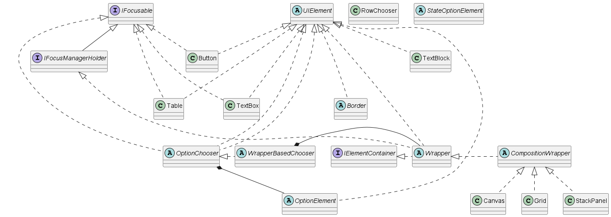

<h1>IFocusable</h1>

The source code of IFocusable is in [IFocusable.cs](../src/Core/FocusFlow/IFocusable.cs).
There you can find some explanation what its members do.

If element implements IFocusable then it can handle keys.
Watch its role in [Core](Core.doc.md) for better understanding.

Simple IFocusable implementation with explanations in [CustomUIElement.doc.md](CustomUIElement.doc.md).

You can find many implementations in the source code.
Here you can see what elements implement it:
 
