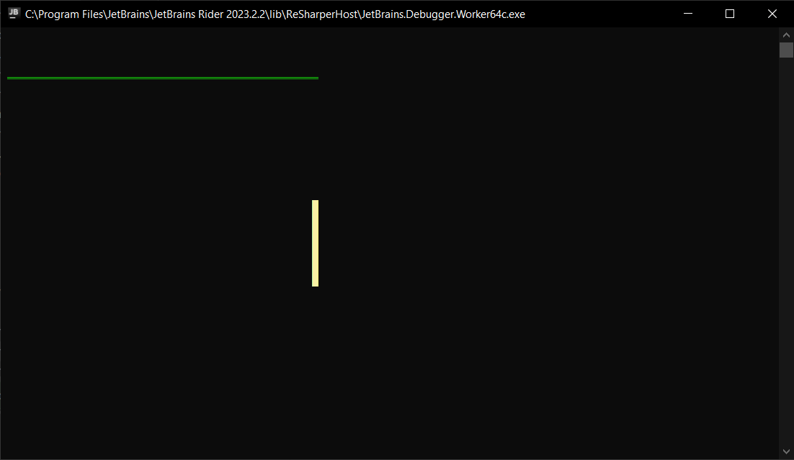
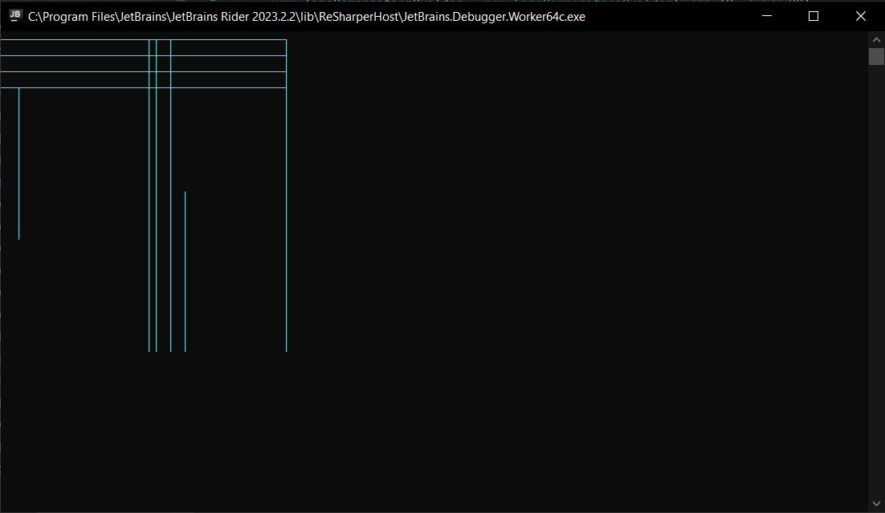

<h1>Line</h1>

Represents simple horizontal or vertical line.

```csharp
public sealed class Line : UIElement
```
You can find its source code in <a href="https://github.com/sunnyyssh/Sunnyyssh.ConsoleUI/blob/master/Sunnyyssh.ConsoleUI/UIElements/Geometry/Line/Line.cs">Line.cs</a>

<h2>Building</h2>
To build Line you should use LineBuilder. (Its source code is in <a href="https://github.com/sunnyyssh/Sunnyyssh.ConsoleUI/blob/master/Sunnyyssh.ConsoleUI/UIElements/Geometry/Line/LineBuilder.cs">LineBuilder.cs</a>)
<br/>

```csharp
public sealed class LineBuilder : IUIElementBuilder<Line>
```

Here is an example:

```csharp
using Sunnyyssh.ConsoleUI;

var appBuilder = new ApplicationBuilder(new ApplicationSettings()); // App builder init.

// Freen horizontal line of length of 40% of the whole width.
var greenLineBuilder = new LineBuilder(0.4, Orientation.Horizontal)
{
    LineKind = LineKind.Double, // Line is double.
    Color = Color.Green
};

// Yellow vertical line of length of 6 pixels.
var yellowLineBuilder = new LineBuilder(6, Orientation.Vertical)
{
    LineKind = LineKind.Dense, // Line is dense.
    Color = Color.Yellow
};

appBuilder
    .Add(greenLineBuilder, 1, 3) // Adds greenLineBuilder at left and top position.
    .Add(yellowLineBuilder, 0.4, 0.4) // Adds yellowLineBuilder at 40% left and 40% top.
    .Build() // Application builds.
    .Run(); // Application runs.
```

It runs to this:
<br/>


<h1>LineComposition</h1>

Represents the composition of vertical or horizontal lines.

```csharp
public sealed class LineComposition : UIElement
```
You can find its source code in <a href="https://github.com/sunnyyssh/Sunnyyssh.ConsoleUI/blob/master/Sunnyyssh.ConsoleUI/UIElements/Geometry/Line/LineComposition.cs">LineComposition.cs</a>

<h2>Building</h2>
To build LineComposition you should use LineCompositionBuilder. (Its source code is in <a href="https://github.com/sunnyyssh/Sunnyyssh.ConsoleUI/blob/master/Sunnyyssh.ConsoleUI/UIElements/Geometry/Line/LineCompositionBuilder.cs">LineCompositionBuilder.cs</a>)
<br/>

```csharp
public sealed class LineCompositionBuilder : IUIElementBuilder<LineComposition>
```

Here is an example:

```csharp
using Sunnyyssh.ConsoleUI;

var appBuilder = new ApplicationBuilder(new ApplicationSettings()); // App builder init.

// Cyan single-lined line composition.
var lineCompositionBuilder = new LineCompositionBuilder(40, 20)
{
    Color = Color.Cyan,
    LineKind = LineKind.Single,
};

// Adds specific lines.
lineCompositionBuilder.Add(4, Orientation.Horizontal, 2, 3)
    .Add(10, Orientation.Vertical, 2, 3)
    .Add(20, Orientation.Vertical, 20, 0)
    .Add(20, Orientation.Vertical, 21, 0)
    .Add(20, Orientation.Vertical, 23, 0)
    .Add(40, Orientation.Horizontal, 0, 3)
    .Add(40, Orientation.Horizontal, 0, 2)
    .Add(40, Orientation.Horizontal, 0, 1)
    .Add(40, Orientation.Horizontal, 0, 0)
    .Add(10, Orientation.Vertical, 25, 10)
    .Add(20, Orientation.Vertical, 39, 0);

appBuilder
    .Add(lineCompositionBuilder, 0, 0) // Adds lineCompositionBuilder at left and top position.
    .Build() // Application builds.
    .Run(); // Application runs.
    
```

It runs to this:
<br/>


