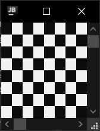

<h1>Rectangle</h1>

It's just rectangle. Nothing more. Just... Rectangle...

```csharp
public sealed class Rectangle : UIElement
```
You can find its source code in <a href="../src/UIElements/Geometry/Rectangle/Rectangle.cs">Rectangle.cs</a>

<h2>Building</h2>
To build Rectangle you should use RectangleBuilder. (Its source code is in <a href="../src/UIElements/Geometry/Rectangle/RectangleBuilder.cs">RectangleBuilder.cs</a>)
<br/>

```csharp
public sealed class RectangleBuilder : IUIElementBuilder<Rectangle>
```


Here is an example:

```csharp
using System.Runtime.InteropServices;
using Sunnyyssh.ConsoleUI;

// If os is windows then it's possible to specify window size.
var settings = RuntimeInformation.IsOSPlatform(OSPlatform.Windows) 
    ? new ApplicationSettings() { Width = 16, Height = 8 }
    : new ApplicationSettings();

var appBuilder = new ApplicationBuilder(settings); // App builder init.

const int fieldSize = 8;

var blackRectBuilder = new RectangleBuilder(1.0 / fieldSize, 1.0 / fieldSize, Color.Black);
var whiteRectBuilder = new RectangleBuilder(1.0 / fieldSize, 1.0 / fieldSize, Color.White);

for (int row = 0; row < fieldSize; row++)
{
    for (int column = 0; column < fieldSize; column++)
    {
        var relationalLeft = column / (double)fieldSize;
        var relationalTop = row / (double)fieldSize;
        var currentRectBuilder = (row + column) % 2 == 0
            ? blackRectBuilder
            : whiteRectBuilder;

        appBuilder.Add(currentRectBuilder, relationalLeft, relationalTop); // Adds rect.
    }
}

appBuilder
    .Build() // Application builds.
    .Run(); // Application runs.
```

It runs to this:
<br/>


