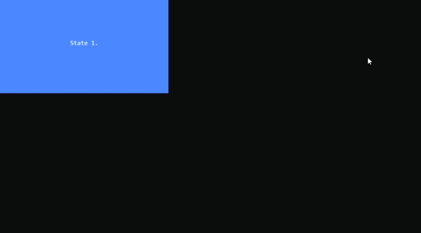

<h1>UIElementSwitcher</h1>

Element that can be one of other elements and switch them.

```csharp
public sealed class UIElementSwitcher : Wrapper, IFocusable
```
You can find its source code in <a href="../src/UIElements/UIElementSwitcher/UIElementSwicther.cs">UIElementSwitcher.cs</a>

<h2>Building</h2>
To build UIElementSwitcher you should use UIElementSwitcherBuilder. (Its source code is in <a href="../src/UIElements/UIElementSwitcher/UIElementSwitcherBuilder.cs">UIElementSwitcherBuilder.cs</a>)
<br/>

```csharp
public sealed class UIElementSwitcherBuilder : IUIElementBuilder<UIElementSwitcher>
```


Here is an example:

```csharp
using System.Collections.Immutable;
using Sunnyyssh.ConsoleUI;

var appBuilder = new ApplicationBuilder(new ApplicationSettings()); // app builder init.

// switcher will have 40% width and 40% height.
var switcherBuilder = new UIElementSwitcherBuilder(0.4, 0.4)
{
    OverridesFlow = false, // The owner (Application in this case) of this switcher can handle some keys itself.
};

// Its own size will be ignored by switcher and set to FullSize,
// so it'd be better if it's FullSize by init.
var button0Builder = new ButtonBuilder(Size.FullSize)
{
    NotFocusedBackground = Color.DarkBlue,
    PressedBackground = Color.Blue, // When it's pressed its background color will be blue.
    Text = "State 1.",
    LoseFocusAfterPress = false,
    HandledKeys = null, // All keys except Escape will be recognized as pressed.
    IgnoredKeys = ImmutableList.Create(ConsoleKey.Escape),
    BorderKind = BorderKind.None,
    ShowPress = true, // It will show press.
    TextHorizontalAligning = HorizontalAligning.Center,
    TextVerticalAligning = VerticalAligning.Center
};

var button1Builder = new ButtonBuilder(Size.FullSize)
{
    NotFocusedBackground = Color.DarkMagenta,
    PressedBackground = Color.Magenta, // When it's pressed its background color will be magenta.
    Text = "State 2.",
    LoseFocusAfterPress = false,
    HandledKeys = null, // All keys except Escape will be recognized as pressed.
    IgnoredKeys = ImmutableList.Create(ConsoleKey.Escape),
    BorderKind = BorderKind.SingleLine,
    ShowPress = true, // It will show press.
    TextHorizontalAligning = HorizontalAligning.Center,
    TextVerticalAligning = VerticalAligning.Center
};

var button2Builder = new ButtonBuilder(Size.FullSize)
{
    NotFocusedBackground = Color.DarkGreen,
    PressedBackground = Color.Green, // When it's pressed its background color will be green.
    Text = "State 3.",
    LoseFocusAfterPress = false,
    HandledKeys = null, // All keys except Escape will be recognized as pressed.
    IgnoredKeys = ImmutableList.Create(ConsoleKey.Escape),
    BorderKind = BorderKind.Dense,
    ShowPress = true, // It will show press.
    TextHorizontalAligning = HorizontalAligning.Center,
    TextVerticalAligning = VerticalAligning.Center
};

// Add elements to switcher.
switcherBuilder.Add(button0Builder, out var builtButton0)
    .Add(button1Builder, out var builtButton1)
    .Add(button2Builder, out var builtButton2);

var app = appBuilder
    .Add(switcherBuilder, Position.LeftTop, out var builtSwitcher) // Add switcher at left top position.
    .Build(); // Application builds.

// After application is built all children are built, so it's not null.
// (Code analysis tools doesn't give an opportunity to annotate this case).
var switcher = builtSwitcher.Element!; 
var button0 = builtButton0.Element!;
var button1 = builtButton1.Element!;
var button2 = builtButton2.Element!;

button0.Pressed += (_, _) => switcher.SwitchTo(1); // It switches to button1.
button1.Pressed += (_, _) => switcher.SwitchTo(2); // It switches to button2.
button2.Pressed += (_, _) => switcher.SwitchTo(0); // It switches to button0.

app.Run();
app.Wait();
```

It runs to this:
<br/>


