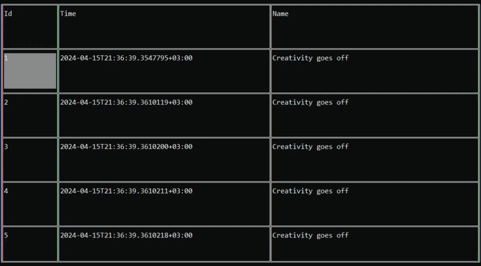
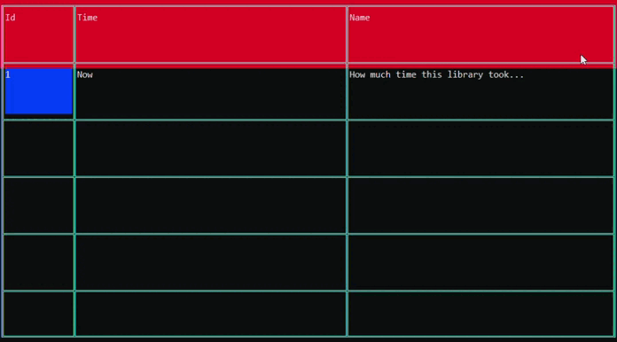

<h1>ViewTable</h1>

Represents a table of content with headers. Can be edited in UI.

```csharp
public sealed class ViewTable : UIElement, IFocusable
```
You can find its source code in <a href="../src/UIElements/Table/ViewTable.cs">ViewTable.cs</a>

<h2>Building</h2>
To build ViewTable you should use ViewTableBuilder. (Its source code is in <a href="../src/UIElements/Table/ViewTableBuilder.cs">ViewTableBuilder.cs</a>)
<br/>

```csharp
public sealed class ViewTableBuilder : IUIElementBuilder<ViewTable>
```


Here is the first example:

```csharp
using System.Collections.Immutable;
using Sunnyyssh.ConsoleUI;

var appBuilder = new ApplicationBuilder(
    new ApplicationSettings() { DefaultForeground = Color.Gray }); // app builder init.

var headers = ImmutableList.Create("Id", "Time", "Name");

var content = Enumerable.Range(1, 100)
    .Select(row => ImmutableList.Create($"{row}", $"{DateTime.Now:O}", "Creativity goes off"))
    .ToImmutableList();

var gridRows = GridRowDefinition.From(1.0, 1.0, 1.0, 1.0, 1.0, 1.0); // 6 equal rows.
var gridColumns = GridColumnDefinition.From(1.0, 4.0, 4.0); // 3 columns with width relations: 1/9, 4/9, 4/9.
var gridDefinition = new GridDefinition(gridRows, gridColumns); // The grid of table.

// Full-sized table with given headers, content and grid.
var tableBuilder = new ViewTableBuilder(Size.FullSize, headers, gridDefinition, content)
{
    BorderLineKind = LineKind.Double,
    CellsWordWrap = true, // Words whould be wrapped.
    UserEditable = false // It may not be edited.
};
    
appBuilder
    .Add(tableBuilder, Position.LeftTop) // Add tableBuilder at left top position.
    .Build()
    .Run();
```

It runs to this:
<br/>


Here is the second example with binding:

```csharp
using System.Collections.Immutable;
using Sunnyyssh.ConsoleUI;

var appBuilder = new ApplicationBuilder(
    new ApplicationSettings() { DefaultForeground = Color.Gray }); // app builder init.

const int rowCount = 100;

var headers = ImmutableList.Create("Id", "Time", "Name");

var gridRows = GridRowDefinition.From(1.0, 1.0, 1.0, 1.0, 1.0, 1.0); // 6 equal rows.
var gridColumns = GridColumnDefinition.From(1.0, 4.0, 4.0); // 3 columns with width relations: 1/9, 4/9, 4/9.
var gridDefinition = new GridDefinition(gridRows, gridColumns); // The grid of table.

// Full-sized table with given headers, content and grid.
var tableBuilder = new ViewTableBuilder(Size.FullSize, headers, gridDefinition, rowCount)
{
    CellFocusedBackground = Color.DarkBlue,
    BorderColorFocused = Color.Cyan,
    HeaderBackground = Color.DarkRed,
    BorderLineKind = LineKind.Double,
    CellsWordWrap = true, // Words whould be wrapped.
    UserEditable = true // It may be edited.
};
    
var app = appBuilder
    .Add(tableBuilder, Position.LeftTop, out var builtViewTable) // Add tableBuilder at left top position.
    .Build();
    
var table = builtViewTable.Element!; // It's not null because app is built.

// Bindable data table.
var dataTable = new BindableDataTable<string?>(rowCount, headers.Count, null);

// It binds dataTable.
table.Bind(dataTable);

dataTable[0, 0] = "1";
dataTable[0, 1] = "Now";
dataTable[0, 2] = "How much time this library took...";

app.Run();
app.Wait();
```

It runs to this:
<br/>


